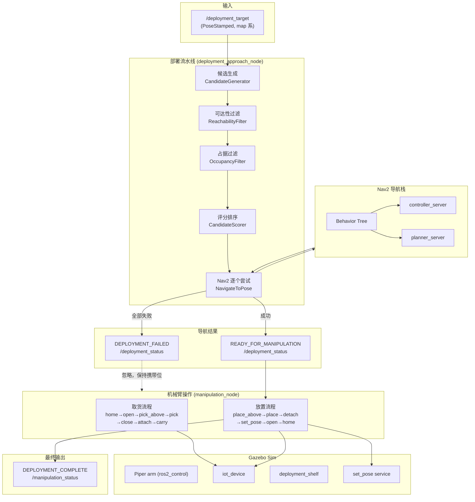

# IoT 自主部署系统——完整学习文档

> 面向开发者本人复习用。讲清"是什么、怎么做、为什么这么做"三层。

---

## 1. 系统总览

### 1.1 硬件组成与软件栈

| 层 | 组件 | 说明 |
|---|------|------|
| 移动底盘 | Scout Mini | 差速轮底盘，`base_link` 为根部坐标系 |
| 机械臂 | Piper 6-DOF | 安装在底盘顶部，7 个关节（6 旋转 + 1 夹爪平移） |
| 感知 | 双激光雷达（前/后）| 各 170° 视场角，位于底盘前后缘 |
| 被操作物 | IoT 设备 | 0.06×0.06×0.03 m、0.1 kg 蓝色小方块 |
| 放置目标 | deployment_shelf | 悬空桌面（0.40×0.30 m），桌面顶部 z=0.35 m |
| 仿真器 | Gazebo Fortress | `ign_ros2_control` + `ros_gz_bridge` 桥接 ROS 2 |
| 中间件 | ROS 2 Humble | Nav2 导航栈、`ros2_control` 关节控制器 |
| 运动学 | 预设 waypoint | 不依赖 IK/MoveIt，直接关节角驱动 |

### 1.2 完整数据流图



**执行顺序（端到端）**：
1. `iot_deployment_launch.py` 启动所有子系统
2. `manipulation_node` 自动执行取货（home → pick_above → pick → close → attach → carry）
3. `manipulation_node` 自动发布放置目标到 `/deployment_target`
4. `deployment_approach_node` 收到目标后执行候选生成→过滤→评分→导航
5. 导航成功后发布 `READY_FOR_MANIPULATION`
6. `manipulation_node` 收到后执行放置流程
7. 放置完成后发布 `DEPLOYMENT_COMPLETE`

---

## 2. 部署流水线逐模块详解

### 2.1 候选位姿生成（CandidateGenerator）

**功能**：以 IoT 目标点为中心，在机械臂可达半径环带上均匀生成候选基座位姿，每个候选的 yaw 朝向目标。

**输入**：目标点坐标 $(t_x, t_y)$（map 系）

**输出**：`List[Candidate]`，每个候选包含 `(x, y, yaw)`

**核心逻辑**：

在半径 $r \in [r_{\min}, r_{\max}]$ 之间均匀取 $N$ 圈，每圈按 $\Delta\theta$ 度均匀分布候选点。候选点坐标与朝向：

$$
\begin{aligned}
x_k &= t_x + r \cdot \cos(k \cdot \Delta\theta \cdot \frac{\pi}{180}) \\
y_k &= t_y + r \cdot \sin(k \cdot \Delta\theta \cdot \frac{\pi}{180}) \\
\text{yaw}_k &= \operatorname{atan2}(t_y - y_k, t_x - x_k)
\end{aligned}
$$

总候选数 $= N \times (360 / \Delta\theta)$。

**关键参数**（来自 `deployment_params.yaml`）：

| 参数 | 当前值 | 含义 |
|------|--------|------|
| `arm_reach_min` | 0.25 m | 最小候选半径 |
| `arm_reach_max` | 0.50 m | 最大候选半径 |
| `candidate_radius_count` | 2 | 圈数 |
| `candidate_angle_step` | 30.0° | 每圈角度步长 |

当前配置产出 $2 \times 12 = 24$ 个候选位姿。

**对应文件**：`iot_deployment/candidate_generator.py`

---

### 2.2 可达性过滤（ReachabilityFilter）

**功能**：过滤掉机械臂物理上无法到达的候选位姿。

**输入**：候选列表 + 目标位姿

**输出**：通过检查的候选列表

**核心逻辑**：

1. **高度检查**：计算机械臂夹爪能达到的绝对高度
   $$z_{\text{gripper}} = z_{\text{base\_link}} + z_{\text{gripper\_offset}} = 0.054 + 0.267 = 0.321 \text{ m}$$
  若 $|z_{\text{gripper}} - z_{\text{target}}| \ge \text{height\_tolerance}$，则目标高度不可达，直接拒绝全部候选。

2. **距离检查**：候选到目标的 2D 距离必须在 $[r_{\min}, r_{\max}]$ 内
   $$r_{\min} \leq \sqrt{(x_c - t_x)^2 + (y_c - t_y)^2} \leq r_{\max}$$

**关键参数**：

| 参数 | 当前值 | 含义 |
|------|--------|------|
| `base_link_z` | 0.054 m | 机械臂安装高度（chassis_top_z） |
| `gripper_z_offset` | 0.267 m | 夹爪相对 piper_base_link 的 z 偏移 |
| `height_tolerance` | 0.25 m | 高度容差 |

**对应文件**：`iot_deployment/reachability_filter.py`

---

### 2.3 占据过滤（OccupancyFilter）

**功能**：基于 `/map` 占据栅格地图，过滤掉周围有障碍物的候选位姿。

**输入**：候选列表 + `/map` OccupancyGrid

**输出**：通过碰撞检查的候选列表

**核心逻辑**：对每个候选，以 `robot_radius` 为圆形范围检查所有栅格。若范围内存在占据（value > 50）或未知（value < 0）栅格，则拒绝该候选。

**关键参数**：

| 参数 | 当前值 | 含义 |
|------|--------|------|
| `robot_radius` | 0.25 m | 机器人碰撞半径 |
| `map_required` | false | 地图未收到时是否拒绝全部（当前跳过检查） |

`map_required: false` 是实际运行中的设置——因为 Gazebo 仿真中 /map 到达时序不稳定，设为 false 可以在无地图时跳过占据检查。

**对应文件**：`iot_deployment/occupancy_filter.py`

---

### 2.4 评分与选择（CandidateScorer）

**功能**：对通过过滤的候选进行多因素评分，选最优。

**输入**：候选列表 + 目标位姿

**输出**：`List[(Candidate, float)]`，按总分降序排列

**核心逻辑**：

1. **距离分**（高斯分布）：理想距离 = `arm_reach_max × ideal_reach_ratio`，离理想距离越近得分越高
   $$S_d = \exp\left(-\frac{1}{2} \left(\frac{d - d_{\text{ideal}}}{\sigma}\right)^2\right)$$
   其中 $d_{\text{ideal}} = 0.50 \times 0.7 = 0.35 \text{ m}$，$\sigma = 0.1$

2. **朝向分**：候选 yaw 与期望朝向（指向目标）的余弦相似度
   $$S_h = \frac{1 + \cos(\text{yaw}_c - \theta_{\text{expected}})}{2}$$

3. **加权总分**：
   $$S = w_d \cdot S_d + w_h \cdot S_h = 0.6 \cdot S_d + 0.4 \cdot S_h$$

**关键参数**：

| 参数 | 当前值 | 含义 |
|------|--------|------|
| `score_distance_weight` | 0.6 | 距离分权重 |
| `score_heading_weight` | 0.4 | 朝向分权重 |
| `ideal_reach_ratio` | 0.7 | 理想距离比例 |
| `reach_sigma` | 0.1 | 高斯标准差 |

**对应文件**：`iot_deployment/candidate_scorer.py`

---

### 2.5 导航集成（deployment_approach_node）

**功能**：按评分从高到低逐个尝试 Nav2 导航，成功后发布 READY 信号，全部失败发布 DEPLOYMENT_FAILED。

**核心逻辑**：

- 收到 `/deployment_target` 后依次执行：`_run_pipeline() → _try_next_candidate()`
- 每个候选通过 `NavigateToPose` action 发送给 Nav2
- 导航成功（`STATUS_SUCCEEDED`）→ 发布 `READY_FOR_MANIPULATION`
- 导航中止 + 机器人距目标 ≤ `proximity_threshold` → 视为到达（容错机制）
- 全部候选失败 → 发布 `DEPLOYMENT_FAILED`
- 新目标到达时先取消进行中的导航（`cancel_goal_async`）

**可视化（MarkerArray）**：
| Marker | 颜色 | 含义 |
|--------|------|------|
| SPHERE | 红 | 目标点 |
| ARROW | 绿 | 选中的最优候选 |
| ARROW | 蓝 | 有效候选（未选中） |
| ARROW | 灰 | 被过滤掉的候选 |

**关键参数**：

| 参数 | 当前值 | 含义 |
|------|--------|------|
| `proximity_threshold` | 1.0 m | 接近即停的距离阈值 |

**对应文件**：`iot_deployment/deployment_approach_node.py`

---

### 2.6 抓取与放置（manipulation_node）

**功能**：控制 Piper 机械臂完成 IoT 设备的抓取和放置，通过 Gazebo DetachableJoint 插件模拟物理抓取，通过 `set_pose` 服务校正放置终态。

#### 取货流水线

```
home → open gripper → pick_above → pick → close gripper → attach → pick_above → carry
```

| 步骤 | 说明 |
|------|------|
| home | 折叠安全姿态 |
| open gripper | 夹爪张开 0.035 m |
| pick_above | 移动到设备上方 5 cm |
| pick | 下降到设备位置 |
| close gripper | 夹爪闭合 0.004 m |
| attach | 通过 gz-transport 创建 DetachableJoint |
| pick_above | 抬起离开储物格 |
| carry | 紧凑携带姿态，避开前激光雷达 |

#### 放置流水线

```
carry → place_above → place → detach → set_pose → open gripper → place_above → home
```

| 步骤 | 说明 |
|------|------|
| place_above | 移动到台面上方 |
| place | 下降到释放点 |
| detach | 断开 DetachableJoint |
| set_pose | 调用 Gazebo set_pose 服务瞬移设备到准确位置 |
| open gripper | 夹爪张开 |
| place_above | 抬起 |
| home | 回到安全姿态 |

#### Attach / Detach 机制

通过 `ign topic` CLI 向 gz-transport topic 发送空消息，触发 `DetachableJoint` 系统插件在父子模型间创建/删除固定关节：

```bash
# attach
ign topic -t /iot_device/attach -m ignition.msgs.Empty -p 'unused: true'

# detach
ign topic -t /iot_device/detach -m ignition.msgs.Empty -p 'unused: true'
```

#### set_pose 校正

detach 后设备受物理引擎影响可能偏离目标。通过 Gazebo set_pose 服务将其瞬移到 `(target_x, target_y, target_z + place_z_offset)`：

```bash
ign service -s /world/simple_test_world/set_pose \
  --reqtype ignition.msgs.Pose --reptype ignition.msgs.Boolean \
  --req 'name: "iot_device" position { x: 3.0 y: -3.0 z: 0.38 } orientation { x: 0 y: 0 z: 0 w: 1 }'
```

#### 6 个 Named Arm Poses

| Pose | joint1 | joint2 | joint3 | joint4 | joint5 | joint6 |
|------|--------|--------|--------|--------|--------|--------|
| `pose_home` | 0.0 | 0.35 | -0.55 | 0.0 | 0.30 | 0.0 |
| `pose_pick_above` | 0.0 | 1.00 | -0.40 | 0.0 | 0.90 | 0.0 |
| `pose_pick` | 0.0 | 1.40 | -0.40 | 0.0 | 0.90 | 0.0 |
| `pose_carry` | 0.0 | 0.55 | -0.95 | 0.0 | 0.55 | 0.0 |
| `pose_place_above` | 0.0 | 1.60 | -1.20 | 0.0 | 1.00 | 0.0 |
| `pose_place` | 0.0 | 1.80 | -1.40 | 0.0 | 1.00 | 0.0 |

#### 关节限位

| 关节 | 类型 | 下限 | 上限 | 单位 |
|------|------|------|------|------|
| joint1 | revolute | -2.618 | 2.618 | rad |
| joint2 | revolute | 0 | 3.14 | rad |
| joint3 | revolute | -2.967 | 0 | rad |
| joint4 | revolute | -1.745 | 1.745 | rad |
| joint5 | revolute | -1.22 | 1.22 | rad |
| joint6 | revolute | -2.0944 | 2.0944 | rad |
| joint7 | prismatic | 0 | 0.035 | m |

**关键参数**：

| 参数 | 当前值 | 含义 |
|------|--------|------|
| `gripper_open` | 0.035 m | 夹爪张开位置 |
| `gripper_closed` | 0.004 m | 夹爪闭合位置 |
| `arm_move_duration` | 3.0 s | 单步臂轨迹时长 |
| `gripper_move_duration` | 1.5 s | 夹爪动作时长 |
| `attach_settle_time` | 0.5 s | attach 后稳定等待 |
| `detach_settle_time` | 0.5 s | detach 后稳定等待 |
| `place_z_offset` | 0.03 m | set_pose 的 z 偏移 |
| `mock_pick` | false | 跳过取货直接放置（调试用） |
| `_max_pick_retries` | 5 | 取货最大重试次数 |

**对应文件**：`iot_deployment/manipulation_node.py`、`config/manipulation_waypoints.yaml`

---

### 2.7 IoT 设备与桌面

**设备（iot_device）**：
- SDF 模型：0.06×0.06×0.03 m，0.1 kg
- 蓝色（ambient 0.0/0.0/1.0），有碰撞盒
- spawn 位置：世界坐标 (0.115, 0, 0.250)，位于底盘顶部（base_link z=0.181 + chassis_top_z=0.054 + 设备半高 0.015 = 0.250）

**桌面（deployment_shelf）**：
- 悬空桌面 0.40×0.30 m，桌面顶部 z=0.35 m
- 支柱后置（x=-0.18 m），机器人可从前方无障碍接近
- 世界位置 (3.0, -3.0, 0)，即地图右下方远处

---

## 3. 接口约定

### 3.1 全部 Topic 汇总

| Topic | 类型 | 方向 | 说明 |
|-------|------|------|------|
| `/deployment_target` | `geometry_msgs/PoseStamped` | manipulation_node → approach_node | 放置目标点（map 系） |
| `/deployment_status` | `std_msgs/String` | approach_node → manipulation_node | `READY_FOR_MANIPULATION` / `DEPLOYMENT_FAILED` |
| `/manipulation_status` | `std_msgs/String` | manipulation_node → 用户 | `DEPLOYMENT_COMPLETE` / `MANIPULATION_FAILED` |
| `/deployment_markers` | `visualization_msgs/MarkerArray` | approach_node → RViz | 四色候选可视化 |
| `/arm_controller/follow_joint_trajectory` | `control_msgs/FollowJointTrajectory` action | manipulation_node → ros2_control | 6-DOF 臂轨迹 |
| `/gripper_controller/follow_joint_trajectory` | `control_msgs/FollowJointTrajectory` action | manipulation_node → ros2_control | 夹爪轨迹 |
| `/joint_states` | `sensor_msgs/JointState` | ros2_control → robot_state_publisher | 从 `/scout_mini/joint_states`（ros_gz_bridge）桥接 |
| `/amcl_pose` | `geometry_msgs/PoseWithCovarianceStamped` | AMCL → 各节点 | 机器人 map 系定位 |
| `/iot_device/attach` | `ignition.msgs.Empty` (gz-transport) | manipulation_node → Gazebo | 触发 DetachableJoint attach |
| `/iot_device/detach` | `ignition.msgs.Empty` (gz-transport) | manipulation_node → Gazebo | 触发 DetachableJoint detach |
| `/world/simple_test_world/set_pose` | `ignition.msgs.Pose` → `ignition.msgs.Boolean` (gz-service) | manipulation_node → Gazebo | 瞬移设备 |
| `/navigate_to_pose` | `nav2_msgs/NavigateToPose` action | approach_node → Nav2 | 导航目标 |
| `/cmd_vel` | `geometry_msgs/Twist` | Nav2 → Gazebo DiffDrive | 差速控制 |

### 3.2 TF 树结构

```
map
  └── odom
        └── base_footprint
              └── base_link
                    ├── piper_base_link                  (fixed: chassis_top_z=0.054, rpy=0)
                    │     ├── link1
                    │     │     └── link2                 (joint2: revolute)
                    │     │           └── link3            (joint3: revolute)
                    │     │                 └── link4      (joint4: revolute)
                    │     │                       └── link5 (joint5: revolute)
                    │     │                             └── link6 (joint6: revolute)
                    │     │                                   └── link7 (joint7: prismatic, 夹爪指尖)
                    │     └── ...                          (joint1: revolute)
                    ├── front_lidar_link                  (fixed, 前雷达)
                    └── rear_lidar_link                   (fixed, 后雷达)
```

- `piper_base_link` 通过 `piper_mount_joint`（fixed）安装在 `base_link` 上方 `chassis_top_z = 0.054 m`
- DetachableJoint 的 parent_link 是 `link7`（夹爪指尖），child_link 是 `iot_device_link`
- Gripper 实际分两步：`link6 → gripper_base`（fixed，SDF 会合并到 link6）→ `link7`（prismatic，真正的夹爪动指）

---

## 4. 工程决策记录

### 4.1 为什么用预设 waypoint 而不用 MoveIt / IK

**问题**：为什么不引入 MoveIt 做运动学规划，而是手写 6 个固定关节角？

决策原因：

1. **URDF → SDF 转换导致 FK 失效**。Gazebo Fortress 将 URDF 转换为 SDF 时会对关节的 `rpy` 做变换（如 `-3.1416` → `3.141585`），且固定关节（如 `gripper_base` 到 link6）在 SDF 中会被"lump-in"合并。纯 Python FK 模型与 Gazebo 实际物理引擎存在严重偏差（实测 TF 与 FK 预测偏差达 19 cm）。

2. **ign_ros2_control 的 joint2 曾经不响应 position command**。根因是 `dynamics damping/friction` 初始值 10.0/10.0 过大，关节阻尼太高导致物理引擎实际不移动关节。改为 1.0/1.0 后恢复正常。在此问题解决前，IK 没有任何意义。

3. **放置终态不需要精确轨迹**。需求明确"精确终态由 set_pose 保证，不做 IK"。waypoint 只需把夹爪大致放到释放区域即可。

4. **工程简化**。6 关节关节角手动调整远快于集成 MoveIt 全套（URDF → SRDF → MoveGroup → 碰撞场景）。

### 4.2 为什么抓取用 attach/detach 而非真实抓取物理

**问题**：为什么不模拟夹爪合拢挤压、摩擦力抓取的物理过程？

决策原因：

1. **Gazebo 接触物理不可靠**。两个独立模型的持续接触仿真在 Gazebo Fortress 中很不稳定，容易出现穿透或弹飞。

2. **DetachableJoint 是 Gazebo 内置的仿真方案**。`ignition-gazebo-detachable-joint-system` 是官方提供的系统插件，通过创建/删除固定关节来模拟"抓住→释放"过程，语义清晰、行为确定。

3. **无需精细夹持力控制**。本系统不研究抓取力/滑移检测，只需要设备跟随夹爪运动。DetachableJoint 完美满足。

### 4.3 /joint_states 双发布者冲突如何解决

**问题**：项目早期 `/joint_states` 有两个发布者——Gazebo 原生 `JointStatePublisher` 和 `ros2_control` 的 `JointStateBroadcaster`，导致 `robot_state_publisher` 收到混乱的 TF。

**解决**：

1. `JointStateBroadcaster` 发布在 `/scout_mini/joint_states`（带 robot namespace 前缀）
2. `ros_gz_bridge` 将这个 topic 桥接到标准的 `/joint_states`
3. Gazebo 原生 `JointStatePublisher` 不再发布 `/joint_states`

这样 `robot_state_publisher` 只收到一份关节状态，TF 树不再混乱。

### 4.4 机械臂挂载高度问题

**问题**：pipier_base_link 应该安装在底盘顶部，但初始没有 `chassis_top_z` 偏移，导致机械臂悬浮在底盘内部。

**解决**：
- 在 `scout_mini_gazebo.xacro` 中定义 `chassis_top_z = 0.054 m`（底盘本体 visual 的实际高度）
- `piper_mount.xacro` 中 `piper_mount_joint` 的 `origin z = chassis_top_z`，将机械臂根部固定在底盘最顶部
- 这一值也用于候选可达性过滤中的 `base_link_z` 参数

### 4.5 放置用 set_pose 校正的原因

**问题**：导航到达容差（Nav2 默认 xy_goal_tolerance=0.25 m）导致机器人实际停车位置与理想候选位姿存在偏差，而 waypoint 关节角是固定的——偏移放大到夹爪末端相当于数十厘米。

**解决**：
- detach 后设备成为自由体，立即通过 Gazebo `set_pose` 服务将其瞬移到 `(target_x, target_y, target_z + place_z_offset)`，速度清零
- `place_z_offset = 0.03 m` 是多出来的一个小偏移（半个设备高度 + 余量），让设备稳稳落在桌面而非穿透
- 这属于 demo 简化——真实系统可能用视觉伺服做末端微调

### 4.6 mock_pick 脚手架的设计意图

**问题**：开发放置流程时需要反复测试，但每次都得等完整的取货→导航→放置链路，效率极低。

**解决**：
- `mock_pick: true` 时，`manipulation_node` 跳过取货（`_picked = True`，`_holding = False`），直接进入放置流程
- 设备手动 spawn 在桌面上方即可验证放置逻辑
- 验收时恢复 `mock_pick: false`

### 4.7 桌子支柱后置的原因

**问题**：初始设计支柱在桌面正中央，导航候选半径 0.25~0.50 m 范围内的候选点都被支柱碰撞盒阻挡，机器人无法真正到达候选位置，只能靠 `proximity_threshold` 强行判定"已到达"——放置只是靠 set_pose 瞬移，物理上不真实。

**解决**：支柱 x 坐标从 0 移至 -0.18 m（桌面后缘），机器人从前方接近时无任何障碍。

### 4.8 joint2 关节运动失效的调试过程

**现象**：通过 `ros2 topic pub` 或 action client 发送 `joint2=1.5`，`controller_state` 显示 `reference: 1.5` 但 `feedback: ~0`。joint1/4/5/6 正常，仅 joint2 和 joint3 不动。

**排查**：
1. 排除 controller_spawner 时序问题——iot_deployment_launch 的 TimerAction 保证了正确的加载顺序
2. 通过 `ign topic` 直查 Gazebo 物理引擎，确认是 Gazebo 端就不响应
3. 检查 `dynamics damping/friction` 从 10.0 降到 1.0 后恢复正常

**根因**：`dynamics damping="10.0" friction="10.0"` 给了极高的关节阻尼，ros2_control 在 position command 模式下通过 PID 控制关节运动，但阻尼太大导致 PID 输出无法克服阻力。

---

## 5. 关键文件索引

| 文件路径 | 功能 | 对应流水线环节 |
|----------|------|----------------|
| `launch/iot_deployment_launch.py` | 端到端启动（Nav2 + controllers + 导航节点 + 操作节点 + IoT spawn） | 全链路 |
| `iot_deployment/deployment_approach_node.py` | 候选生成→过滤→评分→Nav2 导航编排，marker 发布 | 导航流水线 |
| `iot_deployment/candidate_generator.py` | 环形采样生成候选基座位姿 | 候选生成 |
| `iot_deployment/reachability_filter.py` | 高度+距离可达性过滤 | 可达性过滤 |
| `iot_deployment/occupancy_filter.py` | 基于 /map 占据栅格的碰撞过滤 | 占据过滤 |
| `iot_deployment/candidate_scorer.py` | 高斯距离分+朝向分加权评分 | 评分与选择 |
| `iot_deployment/manipulation_node.py` | 取货+放置流程编排，attach/detach/set_pose | 抓取与放置 |
| `config/manipulation_waypoints.yaml` | 6 个 named poses + 夹爪参数 + 时间参数 + 设备 spawn 坐标 | 抓取与放置参数 |
| `config/deployment_params.yaml` | 候选生成/过滤/评分参数 | 导航流水线参数 |
| `config/piper_controllers.yaml` | ros2_control controller 定义（arm/gripper/jsb） | 关节控制 |
| `urdf/piper_mount.xacro` | 机械臂挂载关节 + DetachableJoint 插件 | 机械臂集成 |
| `urdf/scout_mini_gazebo.xacro` | 底盘 URDF（含 chassis_top_z=0.054） | 底盘定义 |
| `../piper_description/urdf/piper_description.xacro` | Piper 机械臂完整 URDF（7 关节 + 限位 + 惯性） | 机械臂定义 |
| `worlds/simple_test_world.world` | 仿真世界（含 deployment_shelf） | 仿真环境 |
| `worlds/iot_device.sdf` | IoT 设备模型（0.06×0.06×0.03 m，0.1 kg） | IoT 设备 |
| `worlds/pickup_table.sdf` | 桌面取货用桌子（备用，当前未使用） | 仿真环境 |
| `rviz/iot_deployment.rviz` | RViz 布局（含 MarkerArray display） | 可视化 |
| `iot_deployment/calibrate_pick_pose.py` | FK 校准脚本（开发工具） | 调试工具 |
| `iot_deployment/test_joint.py` | 单关节测试脚本（开发工具） | 调试工具 |
| `iot_deployment/tf_scan.py` | TF 扫描 + 候选评估脚本（开发工具） | 调试工具 |
