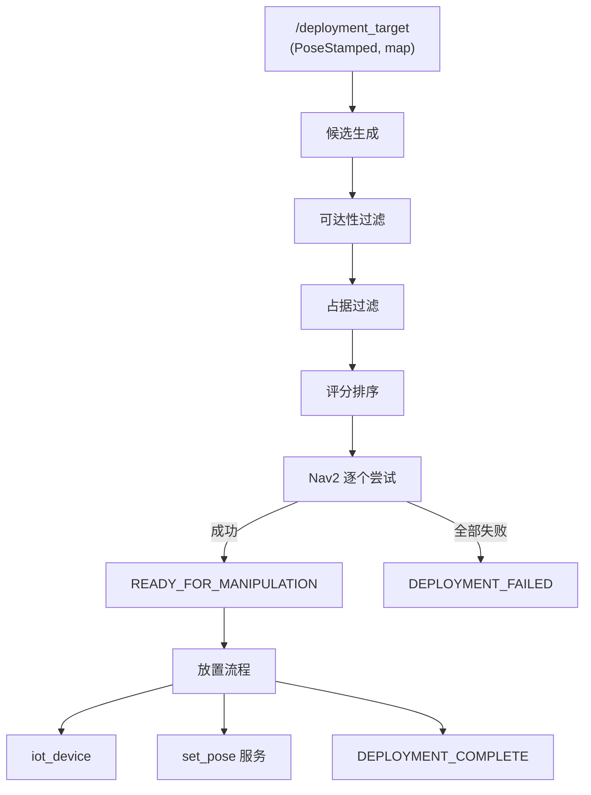
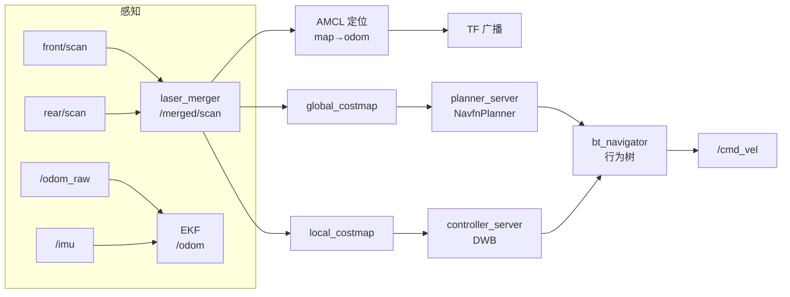

<!-- _class: lead -->

# IoT 自主部署系统
## 从移动导航到机械臂抓取放置的端到端集成

**汇报人：___　日期：___**

---

# 目录

1. 项目背景与目标
2. 系统总览（硬件 / 软件栈 / 数据流）
3. Nav2 导航栈（定位 / 感知融合 / 规划控制）
4. 部署流水线逐模块详解
5. 接口约定（Topic / TF 树）
6. 关键工程决策
7. 实验数据与演示
8. 总结

---

# 1. 项目背景与目标

## 目标
让移动机器人**自主完成** IoT 设备的"取货 → 导航 → 放置"全链路，无需人工干预。

## 核心挑战
- 机械臂末端位置需与目标设备**物理对准**
- 导航终点与固定抓取轨迹之间存在**位姿误差**
- 仿真中"抓取"这一物理过程难以真实模拟

## 验收指标
- 端到端链路无报错、连续成功
- 记录成功率和导航耗时（论文数据）

---

# 2. 系统总览：硬件组成

| 层 | 组件 | 说明 |
|---|------|------|
| 移动底盘 | Scout Mini | 差速轮底盘，`base_link` 为根部坐标系 |
| 机械臂 | Piper 6-DOF | 安装在底盘顶部，7 关节（6 旋转 + 1 夹爪平移） |
| 感知 | 双激光雷达（前/后） | 各 170° 视场角 |
| 被操作物 | IoT 设备 | 0.06×0.06×0.03 m，0.1 kg |
| 放置目标 | deployment_shelf | 悬空桌面 0.40×0.30 m，顶部 z=0.35 m |

---

# 2. 系统总览：软件栈

| 层 | 技术 |
|---|------|
| 仿真器 | Gazebo Fortress（`ign_ros2_control` + `ros_gz_bridge`） |
| 中间件 | ROS 2 Humble |
| 导航 | Nav2（planner / controller / BT） |
| 关节控制 | ros2_control（joint_trajectory_controller） |
| 运动学 | 预设 waypoint（不依赖 IK / MoveIt） |

---

# 2. 系统总览：完整数据流



> 注：导出 PDF 前可将此 Mermaid 图用 mermaid-cli 转成 PNG 后以 `` 插入。

---

# 3. Nav2 导航栈：总体架构

Nav2 是核心导航框架，采用**生命周期节点 + 行为树**编排：



> 定位、感知融合、全局规划、局部控制、行为树、恢复行为六大模块。

---

# 3. Nav2 导航栈：定位（AMCL）

**AMCL（自适应蒙特卡洛定位）**——粒子滤波定位算法：

| 参数 | 值 | 含义 |
|------|-----|------|
| `set_initial_pose` | True | 自动初始化（spawn 原点 yaw=0） |
| `min_particles` / `max_particles` | 500 / 2000 | 粒子数范围 |
| `laser_model_type` | likelihood_field | 似然场观测模型 |
| `robot_model_type` | DifferentialMotionModel | 差速运动模型 |
| `transform_tolerance` | 1.0 s | TF 容忍 |
| `scan_topic` | /merged/scan | 融合后的雷达输入 |

- 订阅 `/merged/scan`（双雷达融合）+ `/odom`（EKF）
- 发布 `map → odom` TF，实现全局定位
- `tf_broadcast: true` 直接广播 TF

---

# 3. Nav2 导航栈：感知融合

## 双激光雷达融合（laser_merger）

前/后两个 170° 激光雷达合并为 360° 全覆盖的 `/merged/scan`：

| 雷达 | topic | 视场 |
|------|-------|------|
| 前雷达 | `/front/scan` | 170°（车头朝 +X） |
| 后雷达 | `/rear/scan` | 170°（车尾） |
| **融合** | `/merged/scan` | **360° 全覆盖** |

## EKF 里程计融合（robot_localization）

差速轮（skid-steer）转弯时**打滑严重**，轮式 yaw 不可信：

$$
\text{融合} = \underbrace{\text{轮式里程计}}_{\text{线速度可信}} + \underbrace{\text{IMU}}_{\text{yaw/角速度可信}}
$$

- 轮式 yaw/vyaw 协方差大（**不信任**），IMU yaw/vyaw 协方差小（**信任**）
- EKF 直接发布 `odom → base_link` TF，抑制转弯漂移

---

# 3. Nav2 导航栈：全局规划

**planner_server** 使用 NavfnPlanner：

| 参数 | 值 | 含义 |
|------|-----|------|
| `plugin` | NavfnPlanner | 全局规划器 |
| `use_astar` | false | 用 Dijkstra（保证最短路径） |
| `tolerance` | 0.5 m | 路径到达容差 |
| `allow_unknown` | true | 允许穿过未知区域 |

- 基于 `global_costmap`（map 系）生成全局路径
- 输出到 controller_server 供局部跟踪

## global_costmap

| 参数 | 值 |
|------|-----|
| `robot_radius` | 0.3 m |
| `resolution` | 0.05 m |
| `inflation_radius` | 0.55 m |
| plugins | static + obstacle + inflation |

---

# 3. Nav2 导航栈：局部控制（DWB）

**controller_server** 使用 DWB 局部规划器（动态窗口）：

| 参数 | 值 | 含义 |
|------|-----|------|
| `max_vel_x` | 0.5 m/s | 最大线速度 |
| `max_vel_theta` | 1.0 rad/s | 最大角速度 |
| `acc_lim_x` | 1.0 m/s² | 线加速度 |
| `controller_frequency` | 20 Hz | 控制频率 |
| `xy_goal_tolerance` | 0.25 m | 到达容差 |
| `yaw_goal_tolerance` | 0.5 rad | 朝向容差 |

**Critics（代价函数）**：`RotateToGoal`、`Oscillation`、`BaseObstacle`、`GoalAlign`、`PathAlign`、`PathDist`、`GoalDist`

- 在 `local_costmap`（rolling window 3×3 m）内采样速度空间
- 综合对齐、避障、路径跟踪等代价选出最优速度

---

# 3. Nav2 导航栈：行为树 + 恢复行为

## bt_navigator 行为树

`default_nav_to_pose_bt_xml` 定义导航流程：`ComputePath → FollowPath → GoalReached`，含恢复分支。

## 恢复行为（recoveries_server）

| 恢复插件 | 触发场景 |
|----------|----------|
| `spin` | 原地旋转，寻找新路径 |
| `backup` | 后退，脱离卡住 |
| `wait` | 等待障碍物清除 |

## 生命周期管理

`lifecycle_manager` 统一管理 7 个 Nav2 节点（`autostart: true`），按依赖顺序激活：

```
map_server → amcl → planner_server → controller_server
  → recoveries_server → bt_navigator → waypoint_follower
```

---

# 4. 部署流水线：候选位姿生成

以目标点 $(t_x, t_y)$ 为中心，在可达环带上环形采样：

$$
x_k = t_x + r\cos\theta_k, \quad
y_k = t_y + r\sin\theta_k, \quad
\mathrm{yaw}_k = \operatorname{atan2}(t_y - y_k, t_x - x_k)
$$

| 参数 | 值 | 含义 |
|------|-----|------|
| `arm_reach_min` | 0.25 m | 最小半径 |
| `arm_reach_max` | 0.50 m | 最大半径 |
| `candidate_radius_count` | 2 | 圈数 |
| `candidate_angle_step` | 30° | 角度步长 |

**产出 24 个候选**（2 圈 × 每圈 12 个）。

---

# 4. 部署流水线：可达性过滤

**高度检查**（夹爪绝对工作高度）：

$$
z_{\text{gripper}} = z_{\text{base\_link}} + z_{\text{offset}} = 0.054 + 0.267 = 0.321\ \text{m}
$$

若 $|z_{\text{gripper}} - z_{\text{target}}| \ge \text{tolerance}$，目标高度不可达，拒绝全部。

**距离检查**：候选到目标 2D 距离必须落在 $[0.25, 0.50]$ m 内。

| 参数 | 值 |
|------|-----|
| `base_link_z` | 0.054 m |
| `gripper_z_offset` | 0.267 m |
| `height_tolerance` | 0.25 m |

---

# 4. 部署流水线：占据过滤 + 评分

## 占据过滤
以 `robot_radius=0.25` m 为圆，检查 `/map` 栅格；存在占据/未知栅格则拒绝。

## 评分（加权求和）

$$
S = 0.6 \cdot \underbrace{\exp\!\left(-\tfrac{(d - d_{\text{ideal}})^2}{2\sigma^2}\right)}_{\text{距离分(高斯)}} + 0.4 \cdot \underbrace{\tfrac{1+\cos\Delta\theta}{2}}_{\text{朝向分}}
$$

| 参数 | 值 |
|------|-----|
| `score_distance_weight` | 0.6 |
| `score_heading_weight` | 0.4 |
| `ideal_reach_ratio` | 0.7（理想距离 0.35 m） |
| `reach_sigma` | 0.1 |

---

# 4. 部署流水线：导航集成

- 按评分从高到低，用 `NavigateToPose` **逐个尝试**
- 成功 → 发布 `READY_FOR_MANIPULATION`
- 全部失败 → 发布 `DEPLOYMENT_FAILED`
- 新目标到达 → 先 `cancel_goal_async` 取消旧导航
- **接近即停**：导航中止但距目标 ≤ 1.0 m，视为到达

## RViz MarkerArray 可视化

| Marker | 颜色 | 含义 |
|--------|------|------|
| 球 | 红 | 目标点 |
| 箭头 | 绿 | 选中最优候选 |
| 箭头 | 蓝 | 有效候选 |
| 箭头 | 灰 | 被拒候选 |

---

# 4. 部署流水线：抓取与放置

## 取货流水线
`home → open → pick_above → pick → close → attach → carry`

## 放置流水线
`carry → place_above → place → detach → set_pose → open → home`

## 关键机制
- **attach / detach**：Gazebo `DetachableJoint` 插件，通过 `ign topic` 创建/删除固定关节，模拟"抓住/释放"
- **set_pose 校正**：detach 后调用 `set_pose` 服务把设备瞬移到 `(x, y, z + 0.03)`，速度清零

---

# 4. 部署流水线：6 个 Named Poses

| Pose | j1 | j2 | j3 | j4 | j5 | j6 |
|------|----|----|----|----|----|----|
| home | 0.0 | 0.35 | -0.55 | 0.0 | 0.30 | 0.0 |
| pick_above | 0.0 | 1.00 | -0.40 | 0.0 | 0.90 | 0.0 |
| pick | 0.0 | 1.40 | -0.40 | 0.0 | 0.90 | 0.0 |
| carry | 0.0 | 0.55 | -0.95 | 0.0 | 0.55 | 0.0 |
| place_above | 0.0 | 1.60 | -1.20 | 0.0 | 1.00 | 0.0 |
| place | 0.0 | 1.80 | -1.40 | 0.0 | 1.00 | 0.0 |

夹爪：`open=0.035 m`，`closed=0.004 m`（joint7 平移）。

---

# 5. 接口约定：Topic 汇总

| Topic | 类型 | 说明 |
|-------|------|------|
| `/deployment_target` | PoseStamped | 放置目标（map 系） |
| `/deployment_status` | String | READY / FAILED |
| `/manipulation_status` | String | COMPLETE / FAILED |
| `/deployment_markers` | MarkerArray | 候选可视化 |
| `/arm_controller/follow_joint_trajectory` | action | 6-DOF 臂轨迹 |
| `/gripper_controller/follow_joint_trajectory` | action | 夹爪轨迹 |
| `/joint_states` | JointState | 关节状态（桥接） |
| `/amcl_pose` | PoseWithCovarianceStamped | 定位 |
| `/navigate_to_pose` | action | Nav2 导航 |

---

# 5. 接口约定：TF 树

```
map → odom → base_footprint → base_link
                                ├── piper_base_link (fixed, z=0.054)
                                │     └── link1 → link2 → ... → link7 (夹爪)
                                ├── front_lidar_link
                                └── rear_lidar_link
```

- `piper_base_link` 通过 `piper_mount_joint`（fixed）安装在 `base_link` 上方 0.054 m
- DetachableJoint：parent=`link7`（夹爪指尖），child=`iot_device_link`

> 此处可插入 TF 树截图 ``

---

# 6. 关键工程决策（1/2）

| 决策 | 为什么 |
|------|--------|
| 预设 waypoint 而非 IK/MoveIt | URDF→SDF 转换使 FK 与物理引擎偏差达 19 cm；放置终态由 set_pose 保证，无需精确轨迹 |
| attach/detach 而非真实抓取物理 | Gazebo 接触物理不稳定；DetachableJoint 是官方方案，行为确定 |
| set_pose 校正放置 | Nav2 到达容差放大到末端达数十厘米，用瞬移保证终态 |

---

# 6. 关键工程决策（2/2）

| 决策 | 为什么 |
|------|--------|
| `/joint_states` 双发布冲突 | 只保留 ros2_control 的 broadcaster，经 ros_gz_bridge 桥接，避免 TF 混乱 |
| 挂载高度 chassis_top_z=0.054 | 机械臂根部固定在底盘真实顶部，避免悬浮 |
| mock_pick 脚手架 | 跳过取货直接验证放置，加速开发迭代 |
| 桌子支柱后置 | 支柱居中会卡住机器人，移到后缘（x=-0.18）使导航无障碍 |

---

# 6. 关键工程决策：joint2 卡死排查

**现象**：发送 joint2=1.5，`reference=1.5` 但 `feedback≈0`，仅 joint2/3 不动。

**根因**：URDF 中 `dynamics damping=10.0 friction=10.0` 阻尼过大，PID 输出无法克服阻力。

**修复**：`damping=1.0 friction=1.0` 后恢复正常。

> 这是取货校准一直失败的真正原因——关节根本没动。

---

# 7. 实验数据

## 连跑 10 轮结果（自动化脚本采集）

| 轮次 | 结果 | 取货 (s) | 导航 (s) | 放置 (s) | 总耗时 (s) |
|------|------|---------|---------|---------|-----------|
| 1 | ✅ | 20.18 | 12.07 | 17.00 | 53.25 |
| 2 | ✅ | 20.07 | 12.36 | 20.70 | 57.15 |
| 3 | ✅ | 20.07 | 11.26 | 22.84 | 58.19 |
| 4 | ✅ | 20.02 | 26.88 | 22.09 | 73.00 |
| 5 | ❌ timeout | — | — | — | — |
| 6 | ✅ | 20.08 | 12.96 | 20.26 | 57.31 |
| 7 | ❌ timeout | — | — | — | — |
| 8 | ✅ | 19.88 | 11.96 | 20.47 | 56.32 |
| 9 | ✅ | 19.87 | 11.71 | 22.01 | 57.60 |
| 10 | ✅ | 19.81 | 19.22 | 23.11 | 66.16 |

---

# 7. 实验数据：统计汇总

| 指标 | 取货 | 导航 | 放置 | 端到端 |
|------|------|------|------|--------|
| **成功率** | — | — | — | **80% (8/10)** |
| 均值 | 20.0 s | 14.8 s | 21.1 s | 59.9 s |
| 中位数 | 20.0 s | 12.2 s | 21.4 s | 57.5 s |
| 最小 | 19.81 | 11.26 | 17.00 | 53.25 |
| 最大 | 20.18 | 26.88 | 23.11 | 73.00 |
| 标准差 | **0.12 s** | 5.15 s | 1.83 s | 6.05 s |

## 关键结论

- **取货/放置高度可重复**：取货标准差仅 0.12 s，预设 waypoint 序列执行确定性极强
- **导航是主要波动源**：中位数 12 s（路径直接），最大 26.9 s（绕障/接近即停判定）
- 2 轮失败均发生在**仿真启动阶段**（docker 重启后控制器竞态），非算法逻辑错误；进入运行阶段的 8 轮全部成功

---

# 7. 视频演示

<!-- 导出 HTML 时可嵌入视频 -->
```html
<video src="pick_place_demo.mp4" controls width="90%"></video>
```

**建议分段录制**：
1. 取货（home → attach → carry）
2. 导航（RViz marker + 底盘移动）
3. 放置（place → detach → set_pose → home）

> 截图存档：TF 树、marker、Gazebo 全景。

---

# 8. 总结

- 实现了 **IoT 设备端到端自主部署**：取货 → 导航 → 放置
- 采用**预设 waypoint + DetachableJoint + set_pose 校正**的轻量方案，规避了仿真中 IK 与接触物理的不确定性
- 完整链路打通并验证，具备成功率/耗时的量化基础

**谢谢！**
